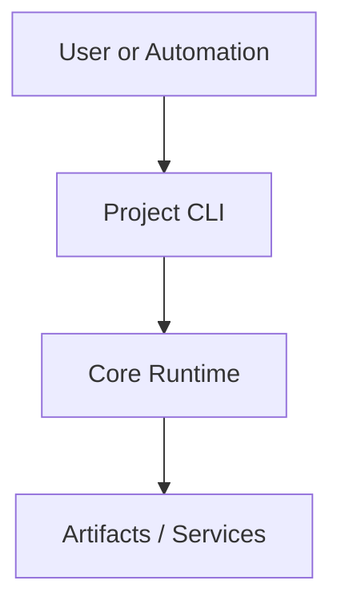

# Architecture Template

Use this file as the standard architecture document for any ToraFirma project.

## Overview

- Project purpose:
- Problem domain:
- Primary user roles:

## Components

Describe the main runtime and build-time components.

| Component | Responsibility | Interfaces |
| --- | --- | --- |
| `component_name` | What it does | APIs, files, messages |

## Data Flow

Summarize how data moves between components.

1. Input ingestion:
2. Processing:
3. Persistence or output:

## API

List externally consumed APIs or commands.

| Surface | Type | Notes |
| --- | --- | --- |
| `example` | CLI / HTTP / library | Usage details |

## Dependencies

Document core dependencies that affect architecture.

| Dependency | Purpose | Risk / Constraints |
| --- | --- | --- |
| `dependency_name` | Why it is required | Version/runtime concerns |

## Mermaid System Diagram

