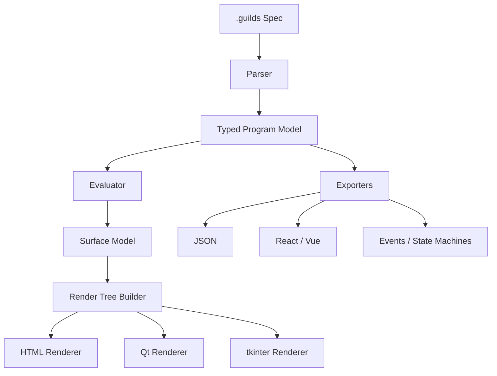

# GUILDS Manual

## Specification-Driven Interface Design

**Version:** 0.1.0  
**Audience:** Developers building internal tools and operator-facing interfaces  
**Purpose:** A concise manual covering the system architecture, build workflow, and reference points for GUILDS.

---

## Table of Contents

1. Overview
2. Core Architecture
3. Build Workflow
4. References

---

## Overview

GUILDS is a specification-first interface toolkit. It describes interfaces as structured cognitive surfaces instead of raw widget trees. The language is built around a few high-value primitives:

- `claim`: information shown to the user
- `afford`: actions the user can take
- `vessel`: a visual grouping
- `stage`: a phase-aware top-level layout
- `flow`: a process model with steps and terminal outcomes

The major advantage is consistency. A single `.guilds` file can drive HTML preview, desktop shells, generated exports, and machine-readable artifacts while preserving the same interaction model.

GUILDS is especially useful for:

- internal tools
- dashboards
- wrappers around scripts and CLI programs
- process monitors
- recovery-sensitive operational interfaces

Its design bias is toward clarity, recoverability, and explicit phase management rather than free-form visual composition.

---

## Core Architecture

GUILDS runs through three main layers:

### Specification Layer

The `.guilds` file defines claims, affordances, vessels, stages, flows, and related contracts.

### Evaluation Layer

The evaluator resolves the specification into a surface model for the current phase. It determines:

- visibility (`render`, `fade`, `hide`)
- certainty and stakes behavior
- flow step state
- transitions and recovery surfaces

### Rendering And Export Layer

Renderers and exporters turn the resolved model into:

- HTML preview
- Python desktop shells
- C++ output
- JSON, React, events, and state-machine artifacts

### Architecture Diagram (Mermaid)



The critical seam is between evaluation and rendering. The evaluator owns meaning; renderers only project that resolved meaning into a target runtime.

---

## Build Workflow

The normal usage sequence is:

### 1. Author

Write a `.guilds` specification that models the UI, phases, and flows.

### 2. Validate

```text
guilds validate myapp.guilds
```

Validation catches parser and rule violations before a backend is generated.

### 3. Build

```text
guilds build myapp.guilds
guilds build myapp.guilds --backend pyside6
```

HTML is the fastest iteration surface. Desktop backends are useful after the phase model stabilizes.

### 4. Render Phase Snapshots

```text
guilds render myapp.guilds idle
guilds render myapp.guilds execute
guilds render myapp.guilds recover
```

This is the fastest way to inspect whether visibility and dominance shift correctly across stages.

### 5. Export

```text
guilds export myapp.guilds json
guilds export myapp.guilds react
guilds export myapp.guilds statemachine
```

### 6. Generate PDF Documentation

```text
guilds pdf docs\guilds_manual.md --output outputs\guilds_manual.pdf
```

The local PDF utility supports markdown, JSON, and plain text sources and uses a consistent page layout, stable margins, and one coherent typography palette.

---

## References

### Key Documentation

- `docs/USER_GUIDE.md`
- `docs/GUILDS_v2_ASCII_Encoded.md`
- `core/README.md`

### Key Source Modules

- `core/guilds_parser.py`
- `core/guilds_evaluator.py`
- `core/guilds_renderer.py`
- `core/guilds_cli.py`

### Common Output Paths

- `outputs/<spec>/guilds_live.html`
- `outputs/<spec>/<name>_statemachine.json`
- `outputs/<spec>/guilds_app_pyside6.py`

This manual is intended as a quick orientation document. The language specification remains the authoritative source for grammar and system constraints.
